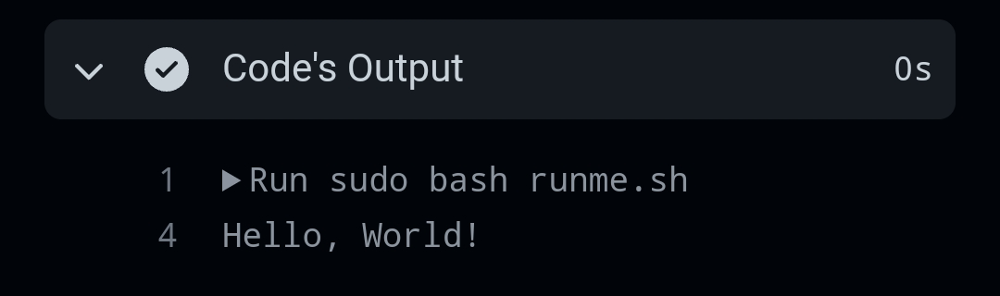

<h1>ruihq/workflow</h1>

&nbsp;
&nbsp;

Run your shell script's in GitHub!

Via editing the runme.sh to your Linux script!

You can see your Code Output after editing the runme.sh or Running the workflow in Actions.

Like this:

